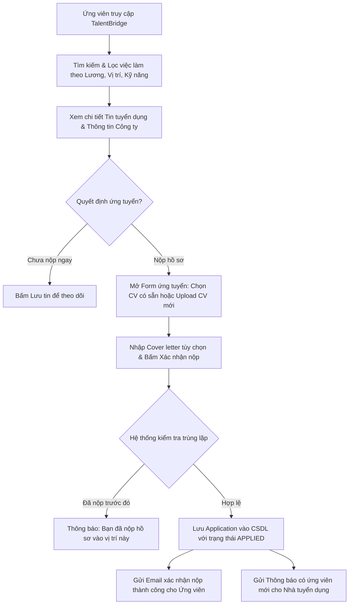
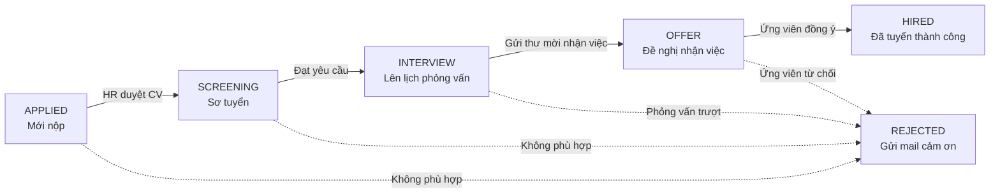

# 🚀 TalentBridge – Nền Tảng Tuyển Dụng Trực Tuyến & Hệ Thống Quản Lý Ứng Viên (ATS)

> **Học phần**: Java Spring 2 – ITC  
> **Repository**: [https://github.com/leduykhanhdevs/TalentBridge_JS2.git](https://github.com/leduykhanhdevs/TalentBridge_JS2.git)  
> **Mô hình kiến trúc**: Java Spring Boot 3 + Spring Data JPA + Spring Security + MySQL + RESTful API / Thymeleaf

---

## 👥 Danh Sách Thành Viên & Bảng Phân Công Công Việc

| STT | Họ và Tên | Vai Trò Trong Dự Án | Module & Nhiệm Vụ Phụ Trách Chính |
| :---: | :--- | :--- | :--- |
| 1 | **Lê Duy Khánh** | **Trưởng nhóm (Team Leader / Architect)** | - Thiết kế kiến trúc tổng thể, Quản lý Git Repository & kiểm duyệt toàn bộ Pull Request. - Khởi tạo Base Project Spring Boot 3, cấu hình Spring Security 6 & JWT / Session. - Quản lý Cơ sở dữ liệu chung (`schema.sql`). - Triển khai **Module Admin**: Kiểm duyệt doanh nghiệp, duyệt tin, quản lý tài khoản người dùng. |
| 2 | **Trần Đình Tình** | **Backend Developer (Job & Search Module)** | - Triển khai **Module Tin tuyển dụng (Jobs)**: CRUD tin tuyển dụng cho Nhà tuyển dụng. - Xây dựng **Bộ lọc & Công cụ tìm kiếm việc làm**: Lọc theo từ khóa, ngành nghề, mức lương, tỉnh thành, cấp bậc. - Xây dựng Scheduled Task (Cron job) tự động quét và đóng các tin hết hạn nộp. |
| 3 | **Nguyễn Phan Minh Hiếu** | **Backend Developer (Company & ATS Pipeline Module)** | - Triển khai **Module Doanh nghiệp (Company Profile)**: Tạo, cập nhật hồ sơ, logo, giới thiệu công ty. - Xây dựng **Quy trình tuyển dụng ATS (Applicant Tracking System)**: Quản lý ứng viên qua các vòng (`APPLIED` $\to$ `SCREENING` $\to$ `INTERVIEW` $\to$ `OFFER` $\to$ `HIRED` / `REJECTED`). - Chức năng Chấm điểm sao (Rating 1-5), Gắn thẻ nhãn (Tags), Ghi chú nội bộ cho từng ứng viên. |
| 4 | **Đặng Trường Thịnh** | **Backend Developer (Candidate & Application Module)** | - Triển khai **Module Hồ sơ Ứng viên (Candidate Profile)**: Thông tin cá nhân, chức danh, mức lương mong muốn. - Quản lý **Upload CV (Resume Management)**: Tải lên file PDF, đặt CV mặc định, xem trước CV. - Luồng **Nộp đơn ứng tuyển (Apply Job)**: Nộp CV + Cover letter, chống nộp trùng lặp. - Tính năng Lưu tin tuyển dụng yêu thích (Saved Jobs) và xem lịch sử các đơn đã nộp. |
| 5 | **Phan Thị Ánh Tuyền** | **Backend & UI/UX Co-Lead (Interview, Mail & Analytics)** | - Triển khai **Module Lịch phỏng vấn (Interviews)**: Tạo lịch, chọn hình thức Online/Offline, link Meet/Zoom. - Tích hợp **Spring Mail**: Gửi email tự động xác nhận nộp hồ sơ, thư mời phỏng vấn, thư thông báo kết quả. - Xây dựng hệ thống **Thông báo trong ứng dụng (In-app Notification)**. - Xây dựng **Dashboard Thống kê & Báo cáo tuyển dụng**: Tỷ lệ ứng viên qua các vòng tuyển dụng. - Hỗ trợ thiết kế giao diện UI/UX và ghép nối API toàn hệ thống. |

---

## 🎯 4 Tác Nhân Chính (Actor List) & Phân Quyền RBAC

1. **Ứng viên (`ROLE_CANDIDATE`)**:
   - Quản lý thông tin cá nhân, kinh nghiệm, kỹ năng.
   - Tải lên, quản lý các bản CV (PDF).
   - Tìm kiếm việc làm với bộ lọc thông minh; lưu tin tuyển dụng.
   - Nộp đơn ứng tuyển kèm CV và thư giới thiệu; theo dõi trạng thái đơn qua từng vòng.
2. **Nhà tuyển dụng (`ROLE_RECRUITER`)**:
   - Quản lý thông tin hồ sơ doanh nghiệp.
   - Đăng tin, cập nhật, gia hạn hoặc đóng tin tuyển dụng.
   - Quản lý danh sách hồ sơ ứng viên theo quy trình ATS từng vòng.
   - Viết ghi chú nội bộ, gắn nhãn phân loại, đánh giá chất lượng ứng viên.
   - Lên lịch phỏng vấn và gửi thư mời phỏng vấn tự động qua email.
3. **Quản trị viên (`ROLE_ADMIN`)**:
   - Quản lý toàn bộ tài khoản người dùng (khóa/mở tài khoản).
   - Phê duyệt thông tin doanh nghiệp mới đăng ký.
   - Kiểm duyệt và gỡ bỏ các tin tuyển dụng có dấu hiệu lừa đảo/sai phạm.
   - Theo dõi báo cáo thống kê vận hành toàn hệ thống.
4. **Hệ thống (`SYSTEM` - Background Worker)**:
   - Tự động chạy định kỳ quét các tin tuyển dụng đã qua ngày `deadline` để đổi trạng thái sang `EXPIRED`.
   - Tự động gửi email nhắc lịch phỏng vấn trước thời điểm diễn ra 24h.

---

## 🧭 Các Luồng Nghiệp Vụ Cốt Lõi (Core Workflows)

### 1. Luồng Tìm Việc & Nộp Hồ Sơ Của Ứng Viên

### 2. Luồng Tuyển Dụng & Sàng Lọc ATS Theo Các Vòng

---

## 🗄️ Thiết Kế Cơ Sở Dữ Liệu (Hoàn Thành Trước 14/09/2026)

Cơ sở dữ liệu được chuẩn hóa theo chuẩn **3NF**, gồm **16 bảng** liên kết chặt chẽ:
- `users`, `roles`, `user_roles`: Quản lý tài khoản & phân quyền.
- `candidates`, `resumes`: Hồ sơ ứng viên và file CV.
- `companies`, `recruiters`: Hồ sơ doanh nghiệp và nhân sự HR.
- `categories`, `skills`, `jobs`, `job_skills`, `saved_jobs`: Việc làm và tìm kiếm.
- `applications`, `application_stages`, `application_notes`: Quản lý đơn ứng tuyển & quy trình ATS.
- `interviews`, `notifications`: Lịch phỏng vấn và thông báo.

> 📖 **Xem chi tiết tài liệu CSDL**: [docs/DATABASE_DESIGN.md](docs/DATABASE_DESIGN.md)  
> 💾 **File script DDL MySQL**: [database/schema.sql](database/schema.sql)

---

## 🛡️ Quy Tắc Làm Việc Nhóm & Quy Trình Git Flow

- **Quy tắc bất khả xâm phạm**: **CẤM PUSH TRỰC TIẾP LÊN NHÁNH `main`**.
- Mọi thành viên tạo nhánh riêng: `feat/<tên-thành-viên>/<tên-module>`.
- Tạo Pull Request (PR) vào nhánh `dev` và gán Reviewer là **Lê Duy Khánh**.
- **Chỉ khi Trưởng nhóm Lê Duy Khánh review code đạt chuẩn mới được merge**.

> 📖 **Xem chi tiết quy chuẩn Git và hướng dẫn thao tác**: [TEAM_RULES_AND_GITFLOW.md](TEAM_RULES_AND_GITFLOW.md)
