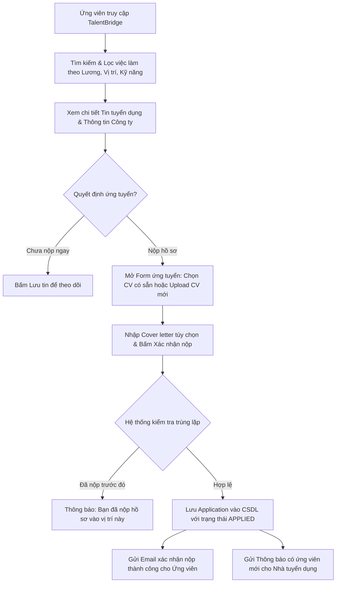
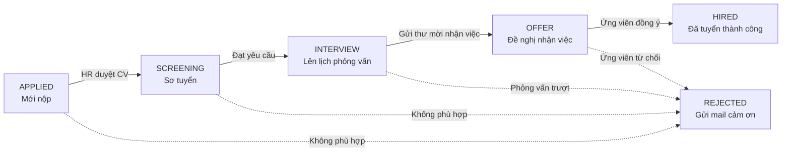

# 🚀 TalentBridge – Nền Tảng Tuyển Dụng Trực Tuyến & Hệ Thống Quản Lý Ứng Viên (ATS)

> **Học phần**: Java Spring 2 – ITC  
> **Repository**: [https://github.com/leduykhanhdevs/TalentBridge_JS2.git](https://github.com/leduykhanhdevs/TalentBridge_JS2.git)  
> **Mô hình kiến trúc**: Java Spring Boot 3 + Spring Data JPA + Spring Security + MySQL + RESTful API / Thymeleaf

---

## 👥 Danh Sách Thành Viên & Bảng Theo Dõi Tiến Độ Chi Tiết (Task Checklist)

### 1. 👑 Lê Duy Khánh – Trưởng nhóm (Tech Lead & Security / Admin Module)
- [x] Đọc và phân tích kỹ tài liệu đề tài `02.docx`.
- [x] Thiết kế kiến trúc tổng thể, danh mục 4 Actor, 7 Feature Modules và các luồng nghiệp vụ.
- [x] Thiết kế CSDL chuẩn hóa 3NF 27 bảng (`docs/DATABASE_DESIGN.md` & `database/schema.sql`).
- [x] Xây dựng bộ quy tắc làm việc nhóm, Git Flow & Quy chuẩn AI Code (`TEAM_RULES_AND_GITFLOW.md`).
- [x] Khởi tạo Repository GitHub, cấu hình `.gitignore`, bảo vệ nhánh `main`, tạo nhánh `dev` và push lên remote.
- [x] Khởi tạo Skeleton Spring Boot 3 (Maven/Gradle, Spring Web, Spring Data JPA, Lombok, Validation).
- [x] Triển khai Module Authentication & Security (User, Role, UserRole, BCrypt, JWT / Form Login, Refresh Token).
- [x] Triển khai Module Admin: API quản lý người dùng (Khóa/Mở User), duyệt doanh nghiệp (`PENDING`/`APPROVED`), kiểm duyệt tin tuyển dụng.
- [ ] Phụ trách Review & Kiểm duyệt tất cả các Pull Request từ thành viên trước khi gộp vào `dev`/`main`.

### 2. 💼 Trần Đình Tình – Backend Developer (Job & Search Module)
- [x] Nghiên cứu đề tài, nắm rõ luồng đăng tin và tìm kiếm việc làm.
- [x] Thống nhất cấu trúc các bảng `jobs`, `categories`, `skills`, `job_skills`.
- [ ] Tạo Entity, Repository, DTO cho `Job`, `Category`, `Skill`, `JobSkill`.
- [ ] Xây dựng Service & Controller CRUD Tin tuyển dụng cho Nhà tuyển dụng (Tạo, Sửa, Ẩn/Hiện, Đóng tin).
- [ ] Xây dựng Bộ lọc & Tìm kiếm việc làm đa tiêu chí (Từ khóa, ngành nghề, khoảng lương min-max, địa điểm, cấp bậc, hình thức làm việc).
- [ ] Xây dựng Scheduled Task (`@Scheduled` cron job) tự động quét và cập nhật các tin quá hạn `deadline` sang `EXPIRED`.
- [ ] Viết Unit Test & Postman Collection kiểm thử toàn bộ API Job & Search.

### 3. 🏢 Nguyễn Phan Minh Hiếu – Backend Developer (Company & ATS Pipeline Module)
- [x] Nghiên cứu đề tài, nắm rõ luồng quản lý doanh nghiệp và quy trình ATS.
- [x] Thống nhất cấu trúc các bảng `companies`, `recruiters`, `application_stages`, `application_notes`.
- [ ] Tạo Entity, Repository, DTO cho `Company`, `Recruiter`, `ApplicationStage`, `ApplicationNote`.
- [ ] Xây dựng Service & Controller quản lý Hồ sơ Doanh nghiệp (Tên, logo, website, quy mô, địa chỉ, trạng thái duyệt).
- [ ] Xây dựng API Quản lý danh sách ứng viên theo từng công việc (ATS Pipeline qua các vòng: `APPLIED` $\to$ `SCREENING` $\to$ `INTERVIEW` $\to$ `OFFER` $\to$ `HIRED` / `REJECTED`).
- [ ] Xây dựng tính năng Đánh giá ứng viên (Rating 1-5 sao, Gắn Tag phân loại, Viết ghi chú nội bộ cho HR).
- [ ] Viết Unit Test & Postman Collection kiểm thử các API Company & ATS Pipeline.

### 4. 📄 Đặng Trường Thịnh – Backend Developer (Candidate & Application Module)
- [x] Nghiên cứu đề tài, nắm rõ luồng hồ sơ ứng viên và nộp đơn tuyển dụng.
- [x] Thống nhất cấu trúc các bảng `candidates`, `resumes`, `applications`, `saved_jobs`.
- [ ] Tạo Entity, Repository, DTO cho `Candidate`, `Resume`, `Application`, `SavedJob`.
- [ ] Xây dựng Service & Controller quản lý Thông tin cá nhân Ứng viên (Title, Kinh nghiệm, Mức lương mong muốn, Địa chỉ).
- [ ] Xây dựng tính năng Quản lý Upload CV (`resumes`): Tải file PDF lên server/cloud, chọn CV mặc định, xem trước CV.
- [ ] Xây dựng Luồng nộp đơn ứng tuyển (`applications`): Nộp hồ sơ kèm Cover Letter, kiểm tra ràng buộc chống nộp trùng lặp (`UNIQUE KEY`).
- [ ] Xây dựng tính năng Lưu tin việc làm (`saved_jobs`) và xem lịch sử các đơn đã nộp kèm trạng thái hiện tại.
- [ ] Viết Unit Test & Postman Collection kiểm thử các API Candidate & Application.

### 5. 📅 Phan Thị Ánh Tuyền – Backend & UI Co-Lead (Interview, Mail & Analytics)
- [x] Nghiên cứu đề tài, nắm rõ luồng phỏng vấn, thông báo và dashboard.
- [x] Thống nhất cấu trúc các bảng `interviews`, `notifications`.
- [ ] Tạo Entity, Repository, DTO cho `Interview`, `Notification`.
- [ ] Xây dựng Service & Controller Lên lịch phỏng vấn (Thời gian, Online qua Meet/Zoom hoặc Offline tại công ty, ghi chú).
- [ ] Cấu hình Spring Mail & Xây dựng Template gửi Email tự động (Xác nhận nộp đơn, Thư mời phỏng vấn, Thông báo kết quả).
- [ ] Xây dựng Module Thông báo trong ứng dụng (In-app notifications) khi có cập nhật đơn/lịch phỏng vấn.
- [ ] Xây dựng API Thống kê & Báo cáo tuyển dụng (Dashboard Metrics: số lượng ứng viên qua từng vòng, tỷ lệ chuyển đổi).
- [ ] Phối hợp thiết kế và ghép nối giao diện Frontend (Thymeleaf / React).

---

## 🎯 4 Tác Nhân Chính (Actor List) & Phân Quyền RBAC

1. **Ứng viên (`ROLE_CANDIDATE`)**:
   - Quản lý thông tin cá nhân, kinh nghiệm, kỹ năng.
   - Tải lên, quản lý các bản CV (PDF).
   - Tìm kiếm việc làm với bộ lọc thông minh; lưu tin tuyển dụng.
   - Nộp đơn ứng tuyển kèm CV và thư giới thiệu; theo dõi trạng thái đơn qua từng vòng.
2. **Nhà tuyển dụng (`ROLE_RECRUITER`)**:
   - Quản lý thông tin hồ sơ doanh nghiệp.
   - Đăng tin, cập nhật, gia hạn hoặc đóng tin tuyển dụng.
   - Quản lý danh sách hồ sơ ứng viên theo quy trình ATS từng vòng.
   - Viết ghi chú nội bộ, gắn nhãn phân loại, đánh giá chất lượng ứng viên.
   - Lên lịch phỏng vấn và gửi thư mời phỏng vấn tự động qua email.
3. **Quản trị viên (`ROLE_ADMIN`)**:
   - Quản lý toàn bộ tài khoản người dùng (khóa/mở tài khoản).
   - Phê duyệt thông tin doanh nghiệp mới đăng ký.
   - Kiểm duyệt và gỡ bỏ các tin tuyển dụng có dấu hiệu lừa đảo/sai phạm.
   - Theo dõi báo cáo thống kê vận hành toàn hệ thống.
4. **Hệ thống (`SYSTEM` - Background Worker)**:
   - Tự động chạy định kỳ quét các tin tuyển dụng đã qua ngày `deadline` để đổi trạng thái sang `EXPIRED`.
   - Tự động gửi email nhắc lịch phỏng vấn trước thời điểm diễn ra 24h.

---

## 🧭 Các Luồng Nghiệp Vụ Cốt Lõi (Core Workflows)

### 1. Luồng Tìm Việc & Nộp Hồ Sơ Của Ứng Viên


### 2. Luồng Tuyển Dụng & Sàng Lọc ATS Theo Các Vòng


---

## 🗄️ Thiết Kế Cơ Sở Dữ Liệu (Hoàn Thành Trước 14/09/2026)

Cơ sở dữ liệu được chuẩn hóa theo chuẩn **3NF**, gồm **27 bảng** liên kết chặt chẽ:
- `users`, `roles`, `user_roles`, `auth_sessions`, `password_reset_tokens`: Quản lý tài khoản, phân quyền & bảo mật phiên đăng nhập.
- `candidates`, `work_experiences`, `educations`, `candidate_skills`, `candidate_projects`, `candidate_certificates`, `candidate_awards`: Hồ sơ ứng viên chuẩn TopCV.
- `cv_templates`, `resumes`: Quản lý mẫu CV & tạo/tải CV.
- `companies`, `recruiters`, `company_join_requests`: Doanh nghiệp, nhân sự HR & yêu cầu gia nhập công ty.
- `categories`, `skills`, `jobs`, `job_skills`, `saved_jobs`: Việc làm, kỹ năng & tìm kiếm.
- `applications`, `application_stages`, `application_notes`: Quản lý đơn ứng tuyển & quy trình ATS pipeline.
- `interviews`, `notifications`: Lịch phỏng vấn và thông báo hệ thống.

> 📖 **Xem chi tiết tài liệu CSDL**: [docs/DATABASE_DESIGN.md](docs/DATABASE_DESIGN.md)  
> 💾 **File script DDL MySQL**: [database/schema.sql](database/schema.sql)

---

## ⚡ Hướng Dẫn Khởi Chạy Nhanh (Quick Start Guide)

### 1. Yêu Cầu Môi Trường (Prerequisites)
- **Java**: JDK 21 LTS (Eclipse Temurin hoặc Oracle OpenJDK).
- **Maven**: Maven 3.9+ (hoặc sử dụng wrapper `./mvnw` / `mvnw.cmd` có sẵn trong repo).
- **Node.js**: Node.js 20+ LTS.
- **Package Manager**: `pnpm` 9+ (khuyên dùng) hoặc `npm`.
- **Cơ sở dữ liệu**: H2 Database (in-memory, tích hợp sẵn ở profile `local`) hoặc MySQL 8.0+ / MariaDB (ở profile `mysql`).

### 2. Bảng Biến Môi Trường (Environment Variables)

| Tên Biến Môi Trường | Bắt Buộc | Giá Trị Mặc Định / Gợi Ý | Mô Tả |
| :--- | :---: | :--- | :--- |
| `JWT_SECRET` | **Có** | `DevJwtSecretMustBeAtLeast256BitsLong32Chars!` | Khóa bí mật ký JWT (tối thiểu 32 ký tự). Hệ thống fail-fast khi khởi động nếu thiếu. |
| `SPRING_PROFILES_ACTIVE` | Không | `local` | Profile cấu hình Spring Boot (`local` dùng H2 DB, `mysql` dùng MySQL thực tế). |
| `CORS_ALLOWED_ORIGINS` | Không | `http://localhost:5173,http://127.0.0.1:5173` | Danh sách domain Frontend được phép kết nối qua CORS. |
| `SPRING_DATASOURCE_URL` | Khi `mysql` | `jdbc:mysql://localhost:3306/talentbridge_db` | URL kết nối MySQL khi chạy profile `mysql`. |
| `SPRING_DATASOURCE_USERNAME`| Khi `mysql` | `root` | Tài khoản kết nối MySQL. |
| `SPRING_DATASOURCE_PASSWORD`| Khi `mysql` | `password` | Mật khẩu tài khoản kết nối MySQL. |
| `MAIL_HOST` | Không | `smtp.gmail.com` | Máy chủ SMTP gửi email đặt lại mật khẩu. |
| `MAIL_PORT` | Không | `587` | Cổng kết nối SMTP. |
| `MAIL_USERNAME` | Không | `your-email@gmail.com` | Email người gửi thông báo hệ thống. |
| `MAIL_PASSWORD` | Không | `your-app-password` | Mật khẩu ứng dụng (App Password) của Gmail/SMTP. |
| `MAIL_FROM` | Không | `TalentBridge <no-reply@talentbridge.vn>` | Tên và địa chỉ hiển thị trong hộp thư đến của người nhận. |

### 3. Khởi Chạy Backend (Spring Boot 3)

```bash
# Trên Linux / macOS
export JWT_SECRET="MySuperSecretKeyForTalentBridgeDevEnvironmentMustBe32CharsLong!"
./mvnw spring-boot:run

# Trên Windows (PowerShell)
$env:JWT_SECRET="MySuperSecretKeyForTalentBridgeDevEnvironmentMustBe32CharsLong!"
.\mvnw.cmd spring-boot:run
```

- **API Base URL**: `http://localhost:8080`
- **Tài liệu Swagger / OpenAPI**: `http://localhost:8080/swagger-ui/index.html`
- **H2 Console** (chỉ ở profile `local`): `http://localhost:8080/h2-console`

### 4. Khởi Chạy Frontend (React 19 + Vite)

```bash
cd frontend
pnpm install
pnpm dev
```

- **Frontend Portal**: `http://localhost:5173` (tự động proxy request `/api/v1/*` sang backend `http://localhost:8080`).

### 5. Kiểm Thử & Kiểm Tra Toàn Diện (Testing & Verification)

```bash
# 1. Kiểm thử toàn bộ Backend (Unit Tests, Slice Tests, Integration Tests)
./mvnw verify

# 2. Kiểm thử toàn bộ Frontend (Unit Tests, E2E Flow Tests, Linting & Production Build)
cd frontend
pnpm test
pnpm lint
pnpm build
```

---

## 🤖 QUY CHUẨN BẮT BUỘC KHI SỬ DỤNG AI ĐỂ CODE (CHUẨN CEO)

Nếu thành viên sử dụng AI (ChatGPT, Gemini, Claude, Cursor, Copilot...) hỗ trợ lập trình, **BẮT BUỘC** phải tuân thủ 5 nguyên tắc thép:

1. **AI phải đọc lại toàn bộ dự án (Full Context Awareness)**: Trước khi code, bắt buộc AI phải đọc `README.md`, `docs/DATABASE_DESIGN.md`, `database/schema.sql` và các class hiện có. Tuyệt đối không để AI code "mù context".
2. **Luôn cập nhật bản mới nhất từ `main`/`dev`**: Chạy `git pull origin dev` trước khi đưa context cho AI làm việc.
3. **Chia nhỏ thành từng task nguyên tử (Atomic Tasks)**: Làm từng việc nhỏ một (Entity $\to$ DTO $\to$ Service $\to$ Controller). Không dồn toàn bộ module vào 1 prompt.
4. **Vòng lặp AI Tester bắt buộc (Verification Loop)**: Sau khi xong mỗi task nhỏ, **AI phải tự tester lại toàn bộ** (kiểm tra biên dịch, test case biên: null, rỗng, số âm, trùng lặp) và **đưa ra kết quả test**. **CHỈ KHI NÀO TEST ĐẠT 100% MỚI ĐƯỢC LÀM TIẾP TASK KHÁC**.
5. **Code tối ưu, chuẩn, dễ đọc, dễ fix, chuẩn CEO**:
   - Clean Code, tuân thủ DRY & SOLID, không lặp code, không code thừa.
   - Đặt tên chuẩn CamelCase, tự giải thích, có comment súc tích tại logic phức tạp.
   - Xử lý ngoại lệ chuẩn hóa qua `@RestControllerAdvice` (không nuốt lỗi).
   - Bảo mật cao (chống SQL Injection), tối ưu truy vấn chống N+1 Query.

---

## 🛡️ Quy Tắc Làm Việc Nhóm & Quy Trình Git Flow

- **Quy tắc bất khả xâm phạm**: **CẤM PUSH TRỰC TIẾP LÊN NHÁNH `main`**.
- Mọi thành viên tạo nhánh riêng: `feat/<tên-thành-viên>/<tên-module>`.
- Tạo Pull Request (PR) vào nhánh `dev` và gán Reviewer là **Lê Duy Khánh**.
- **Chỉ khi Trưởng nhóm Lê Duy Khánh review code đạt chuẩn mới được merge**.

> 📖 **Xem chi tiết quy chuẩn Git và hướng dẫn thao tác**: [TEAM_RULES_AND_GITFLOW.md](TEAM_RULES_AND_GITFLOW.md)
