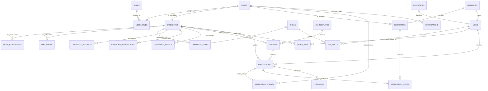

# Thiết Kế Cơ Sở Dữ Liệu: TalentBridge (Java Spring 2)

> **Mục tiêu ưu tiên 4**: Hoàn thành sớm trong tuần, hạn chót Thứ Hai (14/09/2026).  
> **Hệ quản trị CSDL**: MySQL 8.0+ / MariaDB  
> **Mã hóa**: `utf8mb4` (Hỗ trợ tiếng Việt đầy đủ và icon/emoji)  
> **Script DDL thực thi**: [database/schema.sql](../database/schema.sql)  
> **Mã nguồn DBML tương tác**: [docs/talentbridge_erd.dbml](./talentbridge_erd.dbml)  
> **Bản vẽ ERD đồ họa**: [docs/DATABASE_ERD.md](./DATABASE_ERD.md)

---

## 1. Sơ Đồ Thực Thể Quan Hệ (ERD - 23 Bảng Chuẩn Hóa 3NF)



---

## 2. Từ Điển Dữ Liệu (Data Dictionary) & 23 Bảng Chuẩn Hóa 3NF

### 2.1. Nhóm Xác thực & Phân quyền (Authentication & RBAC)

#### Bảng `users`
Lưu trữ thông tin xác thực tài khoản chung cho cả 3 tác nhân (`ROLE_CANDIDATE`, `ROLE_RECRUITER`, `ROLE_ADMIN`).

| Tên Cột | Kiểu Dữ Liệu | Ràng Buộc | Mô Tả |
| :--- | :--- | :--- | :--- |
| `id` | BIGINT | PK, AUTO_INCREMENT | Mã định danh người dùng duy nhất |
| `email` | VARCHAR(150) | UNIQUE, NOT NULL, INDEX | Email đăng nhập |
| `password_hash` | VARCHAR(255) | NOT NULL | Mật khẩu mã hóa BCrypt |
| `full_name` | VARCHAR(100) | NOT NULL | Họ và tên hiển thị |
| `phone` | VARCHAR(20) | NULL | Số điện thoại liên lạc |
| `avatar_url` | VARCHAR(500) | NULL | Đường dẫn ảnh đại diện |
| `status` | VARCHAR(20) | NOT NULL, DEFAULT 'ACTIVE' | `ACTIVE`, `INACTIVE`, `BANNED` |
| `created_at` | TIMESTAMP | DEFAULT CURRENT_TIMESTAMP | Thời gian tạo tài khoản |
| `updated_at` | TIMESTAMP | ON UPDATE CURRENT_TIMESTAMP | Thời gian cập nhật gần nhất |

#### Bảng `roles` & `user_roles`
Hỗ trợ phân quyền linh hoạt theo mô hình Role-Based Access Control (RBAC).
- `roles`: `id` (INT, PK), `name` (VARCHAR(50), UNIQUE - `ROLE_CANDIDATE`, `ROLE_RECRUITER`, `ROLE_ADMIN`).
- `user_roles`: `user_id` (BIGINT, FK `users(id)`), `role_id` (INT, FK `roles(id)`), PK(`user_id`, `role_id`).

---

### 2.2. Nhóm Hồ sơ Ứng viên Chi tiết Chuẩn TopCV (Candidate Profile)

#### Bảng `candidates`
Thông tin ứng viên tìm việc (quan hệ 1-1 với `users`), mở rộng hỗ trợ thông tin cần thiết cho CV Builder.

| Tên Cột | Kiểu Dữ Liệu | Ràng Buộc | Mô Tả |
| :--- | :--- | :--- | :--- |
| `id` | BIGINT | PK, AUTO_INCREMENT | Mã hồ sơ ứng viên |
| `user_id` | BIGINT | UNIQUE, FK `users(id)` | Khóa ngoại tài khoản người dùng |
| `title` | VARCHAR(150) | NULL | Vị trí mong muốn (vd: "Senior Java Developer") |
| `dob` | DATE | NULL | Ngày sinh của ứng viên |
| `gender` | VARCHAR(10) | DEFAULT 'OTHER' | `MALE`, `FEMALE`, `OTHER` |
| `summary` | TEXT | NULL | Giới thiệu bản thân / Mục tiêu nghề nghiệp |
| `experience_years` | INT | DEFAULT 0 | Số năm kinh nghiệm làm việc |
| `current_salary` | DECIMAL(12,2) | NULL | Mức lương hiện tại |
| `expected_salary` | DECIMAL(12,2) | NULL | Mức lương mong muốn |
| `city` | VARCHAR(100) | INDEX | Tỉnh/Thành phố sinh sống |
| `address` | VARCHAR(255) | NULL | Địa chỉ chi tiết |
| `personal_website`| VARCHAR(255) | NULL | Website cá nhân / Portfolio |
| `linkedin_url` | VARCHAR(255) | NULL | Đường dẫn hồ sơ LinkedIn |
| `github_url` | VARCHAR(255) | NULL | Đường dẫn GitHub/GitLab |

#### Bảng `skills`
Danh mục kỹ năng chuẩn hóa dùng chung cho ứng viên và tin tuyển dụng (Java, Spring Boot, MySQL, Docker, React...).

#### Bảng `work_experiences` (Lịch sử làm việc)
Lưu lại toàn bộ quá trình công tác qua các công ty của ứng viên.

| Tên Cột | Kiểu Dữ Liệu | Ràng Buộc | Mô Tả |
| :--- | :--- | :--- | :--- |
| `id` | BIGINT | PK, AUTO_INCREMENT | Mã bản ghi kinh nghiệm |
| `candidate_id` | BIGINT | FK `candidates(id)`, INDEX | Khóa ngoại ứng viên |
| `company_name` | VARCHAR(200) | NOT NULL | Tên công ty / tổ chức |
| `position` | VARCHAR(150) | NOT NULL | Vị trí / chức danh công việc |
| `start_date` | DATE | NOT NULL | Ngày/tháng bắt đầu làm |
| `end_date` | DATE | NULL | Ngày kết thúc (NULL nếu đang làm việc) |
| `is_current` | BOOLEAN | DEFAULT FALSE | Có phải công việc hiện tại |
| `description` | TEXT | NULL | Mô tả nhiệm vụ, trách nhiệm |
| `achievements` | TEXT | NULL | Thành tựu nổi bật / Kết quả công việc |

#### Bảng `educations` (Lịch sử học vấn)
Quá trình đào tạo đại học, cao đẳng hoặc các chứng chỉ học thuật.

| Tên Cột | Kiểu Dữ Liệu | Ràng Buộc | Mô Tả |
| :--- | :--- | :--- | :--- |
| `id` | BIGINT | PK, AUTO_INCREMENT | Mã bản ghi học vấn |
| `candidate_id` | BIGINT | FK `candidates(id)`, INDEX | Khóa ngoại ứng viên |
| `institution_name`| VARCHAR(200)| NOT NULL | Tên trường ĐH / CĐ / Viện đào tạo |
| `degree` | VARCHAR(100) | NOT NULL | Bằng cấp (Cử nhân, Kỹ sư, Thạc sĩ...) |
| `field_of_study` | VARCHAR(150) | NOT NULL | Chuyên ngành đào tạo |
| `start_date` | DATE | NOT NULL | Thời gian bắt đầu |
| `end_date` | DATE | NULL | Thời gian kết thúc |
| `is_current` | BOOLEAN | DEFAULT FALSE | Đang theo học |
| `gpa` | VARCHAR(20) | NULL | Điểm trung bình (vd: "3.6 / 4.0") |
| `description` | TEXT | NULL | Đề tài tốt nghiệp hoặc hoạt động nổi bật |

#### Bảng `candidate_skills` (Kỹ năng của ứng viên)
Liên kết N-N giữa ứng viên và danh mục kỹ năng, kèm xếp hạng sao chuẩn TopCV.

| Tên Cột | Kiểu Dữ Liệu | Ràng Buộc | Mô Tả |
| :--- | :--- | :--- | :--- |
| `id` | BIGINT | PK, AUTO_INCREMENT | Mã bản ghi |
| `candidate_id` | BIGINT | FK `candidates(id)` | Ứng viên sở hữu kỹ năng |
| `skill_id` | INT | FK `skills(id)` | Kỹ năng cụ thể |
| `proficiency_level`| VARCHAR(30)| DEFAULT 'INTERMEDIATE' | `BEGINNER`, `INTERMEDIATE`, `ADVANCED`, `EXPERT` |
| `rating` | TINYINT | DEFAULT 3 | Đánh giá 1 đến 5 sao như TopCV |
| `years_of_experience`| DECIMAL(3,1)| DEFAULT 1.0 | Số năm làm việc với kỹ năng này |

#### Bảng `candidate_projects` (Dự án thực tế / cá nhân)
Danh mục sản phẩm, dự án thực tế đã hoàn thành để thuyết phục nhà tuyển dụng.

| Tên Cột | Kiểu Dữ Liệu | Ràng Buộc | Mô Tả |
| :--- | :--- | :--- | :--- |
| `id` | BIGINT | PK, AUTO_INCREMENT | Mã dự án |
| `candidate_id` | BIGINT | FK `candidates(id)`, INDEX | Ứng viên |
| `project_name` | VARCHAR(200) | NOT NULL | Tên dự án |
| `role` | VARCHAR(100) | NOT NULL | Vai trò (Backend Lead, Fullstack Dev) |
| `team_size` | INT | NULL | Quy mô số lượng thành viên |
| `start_date` | DATE | NOT NULL | Ngày bắt đầu |
| `end_date` | DATE | NULL | Ngày kết thúc |
| `is_current` | BOOLEAN | DEFAULT FALSE | Đang thực hiện |
| `technologies` | VARCHAR(500) | NULL | Công nghệ sử dụng (vd: "Java, Docker, MySQL") |
| `project_url` | VARCHAR(500) | NULL | Đường dẫn trang web / demo |
| `github_url` | VARCHAR(500) | NULL | Đường dẫn mã nguồn GitHub |
| `description` | TEXT | NULL | Mô tả dự án |
| `responsibilities`| TEXT | NULL | Công việc cụ thể phụ trách |

#### Bảng `candidate_certificates` & `candidate_awards`
- `candidate_certificates`: Lưu chứng chỉ chuyên ngành (AWS, IELTS, Cisco, Oracle...).
- `candidate_awards`: Lưu giải thưởng học tập, thi đấu hackathon, danh hiệu nhân viên xuất sắc.

---

### 2.3. Nhóm Mẫu CV & Bộ Sinh CV Tự Động (CV Templates & Generator)

#### Bảng `cv_templates`
Lưu trữ kho mẫu CV phong phú được thiết kế sẵn theo ngành nghề.

| Tên Cột | Kiểu Dữ Liệu | Ràng Buộc | Mô Tả |
| :--- | :--- | :--- | :--- |
| `id` | INT | PK, AUTO_INCREMENT | Mã mẫu CV |
| `name` | VARCHAR(100) | NOT NULL | Tên mẫu CV (vd: "Modern IT Standard") |
| `template_code` | VARCHAR(50) | UNIQUE, NOT NULL | Mã code hệ thống (MODERN_IT_01, CLASSIC_01) |
| `thumbnail_url` | VARCHAR(500) | NULL | Ảnh chụp xem trước mẫu CV |
| `description` | VARCHAR(255) | NULL | Mô tả mẫu và đối tượng phù hợp |
| `default_config`| JSON | NULL | Cấu hình màu chủ đạo, font, cấu trúc cột |
| `is_active` | BOOLEAN | DEFAULT TRUE | Trạng thái hiển thị |

#### Bảng `resumes` (Nâng cấp đa năng)
Quản lý cả CV tải lên từ máy tính (`UPLOADED`) và CV tạo tự động từ hồ sơ profile (`GENERATED`).

| Tên Cột | Kiểu Dữ Liệu | Ràng Buộc | Mô Tả |
| :--- | :--- | :--- | :--- |
| `id` | BIGINT | PK, AUTO_INCREMENT | Mã CV |
| `candidate_id` | BIGINT | FK `candidates(id)`, INDEX | Ứng viên sở hữu CV |
| `template_id` | INT | NULL, FK `cv_templates(id)` | Mẫu CV áp dụng (nếu là CV sinh tự động) |
| `resume_type` | VARCHAR(20) | NOT NULL, DEFAULT 'UPLOADED'| `UPLOADED` hoặc `GENERATED` |
| `title` | VARCHAR(200) | NOT NULL | Tiêu đề hồ sơ (vd: "CV Java Backend 2026") |
| `file_name` | VARCHAR(255) | NOT NULL | Tên tệp tin |
| `file_url` | VARCHAR(500) | NOT NULL | Đường dẫn file PDF |
| `is_default` | BOOLEAN | DEFAULT FALSE | Có phải CV mặc định để nộp nhanh |
| `customization_json`| JSON | NULL | Tùy biến màu sắc, thứ tự section, ẩn hiện mục |
| `parsed_text` | LONGTEXT | NULL | Nội dung text trích xuất cho AI Matching |

---

### 2.4. Nhóm Doanh nghiệp & Nhà tuyển dụng (Companies & Recruiters)
- `companies`: Hồ sơ doanh nghiệp tuyển dụng (`id`, `name`, `logo_url`, `banner_url`, `website`, `company_size`, `address`, `city`, `status`).
- `recruiters`: Nhân viên tuyển dụng thuộc một doanh nghiệp cụ thể (quan hệ 1-1 với `users`, N-1 với `companies`).

---

### 2.5. Nhóm Việc làm & Tìm kiếm (Jobs & Search Engine)
- `categories`: Nhóm ngành nghề tuyển dụng (slug URL thân thiện SEO).
- `jobs`: Tin tuyển dụng do nhà tuyển dụng đăng tải (`salary_min`, `salary_max`, `job_type`, `experience_level`, `deadline`, `status`).
- `job_skills`: Bảng trung gian N-N giữa Jobs và Skills.
- `saved_jobs`: Ứng viên lưu việc làm quan tâm (ràng buộc `UNIQUE(candidate_id, job_id)`).

---

### 2.6. Nhóm Ứng tuyển & Quản lý vòng tuyển dụng ATS (ATS Pipeline)
- `applications`: Trung tâm quản lý ứng tuyển kết nối `job_id`, `candidate_id`, và `resume_id`.
- `application_stages`: Lịch sử lưu vết các vòng tuyển dụng (`APPLIED` $\to$ `SCREENING` $\to$ `INTERVIEW` $\to$ `OFFER` $\to$ `HIRED`/`REJECTED`).
- `application_notes`: HR viết nhận xét nội bộ, chấm điểm sao (1-5 sao) và gắn thẻ ứng viên.
- `interviews`: Quản lý lịch phỏng vấn (Online Meet/Zoom hoặc Offline tại công ty).
- `notifications`: Thông báo trong ứng dụng cho người dùng.

---

## 3. 🎯 Kiến Trúc Tính Năng "Generate Resume Từ Profile" (Resume Builder)

```
[ Hồ sơ ứng viên TopCV ]
  ├── candidates (Thông tin cá nhân, mục tiêu)
  ├── work_experiences (Lịch sử làm việc)
  ├── educations (Học vấn & Bằng cấp)
  ├── candidate_skills (Kỹ năng & Số sao)
  ├── candidate_projects (Dự án thực tế)
  └── candidate_certificates (Chứng chỉ)
            │
            │ 1. Chọn Template (cv_templates)
            │ 2. Tùy chỉnh màu sắc, phông chữ, thứ tự section
            ▼
┌─────────────────────────────────────────────────────────────┐
│               RESUME GENERATOR SERVICE                      │
│ - Thu thập dữ liệu JSON từ các bảng Profile con             │
│ - Áp dụng theme từ cv_templates & customization_json        │
│ - Render HTML template (Thymeleaf / OpenHTMLtoPDF)          │
│ - Kết xuất ra file PDF hoàn chỉnh                           │
└─────────────────────────────┬───────────────────────────────┘
                              │
                              ▼
[ Bản ghi resumes (resume_type = 'GENERATED') ]
  └── Sẵn sàng nộp trực tiếp vào các tin tuyển dụng (applications)!
```

---

## 4. ⚡ Chiến Lược Tối Ưu Hiệu Năng & Toàn Vẹn CSDL

1. **Chuẩn hóa 3NF tuyệt đối**:
   - Loại bỏ hoàn toàn dư thừa dữ liệu. Các thông tin lặp lại nhiều lần (kinh nghiệm, học vấn, kỹ năng, dự án) đều được tách thành các quan hệ 1-N chuẩn hóa.
2. **Hệ thống Composite Indexes**:
   - `jobs(status, deadline)`: Lọc nhanh các tin việc làm đang mở.
   - `jobs(city, category_id)`: Tối ưu bộ lọc đa tiêu chí trên trang chủ.
   - `candidate_skills(candidate_id, skill_id)`: Đảm bảo không trùng lặp kỹ năng và tăng tốc độ tìm kiếm ứng viên theo skill.
   - `applications(job_id, current_stage)`: Phục vụ trực tiếp cho màn hình Kanban ATS của nhà tuyển dụng.
3. **Toàn vẹn tham chiếu (Cascade Constraints)**:
   - Các bảng phụ thuộc dữ liệu ứng viên (`work_experiences`, `educations`, `candidate_skills`, `candidate_projects`, `candidate_certificates`, `candidate_awards`, `resumes`) đều cấu hình `ON DELETE CASCADE`. Khi một ứng viên xóa tài khoản, toàn bộ dữ liệu profile liên quan sẽ được dọn dẹp sạch sẽ, không để lại dữ liệu rác.