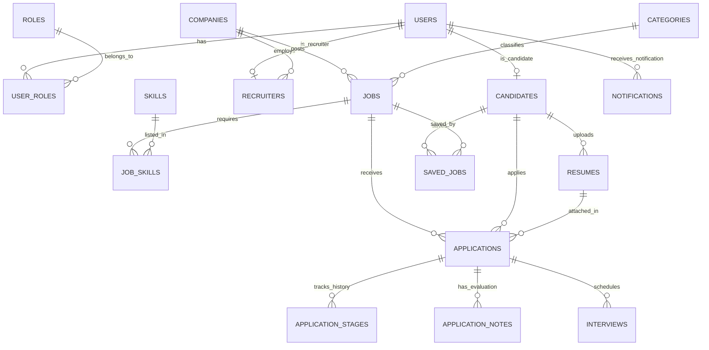

# Thiết Kế Cơ Sở Dữ Liệu: TalentBridge (Java Spring 2)

> **Mục tiêu ưu tiên 4**: Hoàn thành sớm trong tuần, hạn chót Thứ Hai (14/09/2026).  
> **Hệ quản trị CSDL**: MySQL 8.0+ / MariaDB  
> **Mã hóa**: `utf8mb4` (Hỗ trợ tiếng Việt đầy đủ và icon/emoji)  
> **Script DDL thực thi**: [database/schema.sql](../database/schema.sql)

---

## 1. Sơ Đồ Thực Thể Quan Hệ (ERD - Entity Relationship Diagram)

---

## 2. Từ Điển Dữ Liệu (Data Dictionary) & 16 Bảng Chuẩn Hóa 3NF

### 2.1. Nhóm Xác thực & Người dùng (Authentication & Users)

#### Bảng `users`
Lưu trữ thông tin xác thực dùng chung cho toàn bộ các tác nhân (Ứng viên, Nhà tuyển dụng, Quản trị viên).

| Tên Cột | Kiểu Dữ Liệu | Ràng Buộc | Mô Tả |
| :--- | :--- | :--- | :--- |
| `id` | BIGINT | PK, AUTO_INCREMENT | Mã định danh duy nhất |
| `email` | VARCHAR(150) | UNIQUE, NOT NULL, INDEX | Email đăng nhập hệ thống |
| `password_hash` | VARCHAR(255) | NOT NULL | Mật khẩu mã hóa BCrypt |
| `full_name` | VARCHAR(100) | NOT NULL | Họ và tên hiển thị |
| `phone` | VARCHAR(20) | NULL | Số điện thoại liên hệ |
| `avatar_url` | VARCHAR(500) | NULL | Đường dẫn ảnh đại diện |
| `status` | VARCHAR(20) | NOT NULL, DEFAULT 'ACTIVE' | `ACTIVE`, `INACTIVE`, `BANNED` |
| `created_at` | TIMESTAMP | DEFAULT CURRENT_TIMESTAMP | Thời gian tạo tài khoản |
| `updated_at` | TIMESTAMP | ON UPDATE CURRENT_TIMESTAMP | Thời gian cập nhật gần nhất |

#### Bảng `roles` & `user_roles`
Hỗ trợ phân quyền linh hoạt theo mô hình Role-Based Access Control (RBAC).
- `roles`: `id` (INT, PK), `name` (VARCHAR(50), UNIQUE - `ROLE_CANDIDATE`, `ROLE_RECRUITER`, `ROLE_ADMIN`).
- `user_roles`: `user_id` (BIGINT, FK), `role_id` (INT, FK), PK(`user_id`, `role_id`).

---

### 2.2. Nhóm Hồ sơ Ứng viên & CV (Candidate & Resumes)

#### Bảng `candidates`
Mở rộng 1-1 với bảng `users` dành riêng cho ứng viên tìm việc.

| Tên Cột | Kiểu Dữ Liệu | Ràng Buộc | Mô Tả |
| :--- | :--- | :--- | :--- |
| `id` | BIGINT | PK, AUTO_INCREMENT | Mã ứng viên |
| `user_id` | BIGINT | UNIQUE, FK `users(id)` | Khóa ngoại liên kết tài khoản user |
| `title` | VARCHAR(150) | NULL | Vị trí mong muốn (vd: "Java Backend Developer") |
| `summary` | TEXT | NULL | Giới thiệu tóm tắt bản thân |
| `experience_years` | INT | DEFAULT 0 | Số năm kinh nghiệm làm việc |
| `current_salary` | DECIMAL(12,2) | NULL | Mức lương hiện tại |
| `expected_salary` | DECIMAL(12,2) | NULL | Mức lương kỳ vọng |
| `city` | VARCHAR(100) | INDEX | Tỉnh/Thành phố sinh sống |
| `address` | VARCHAR(255) | NULL | Địa chỉ chi tiết |

#### Bảng `resumes`
Quản lý các file CV ứng viên tải lên hệ thống.

| Tên Cột | Kiểu Dữ Liệu | Ràng Buộc | Mô Tả |
| :--- | :--- | :--- | :--- |
| `id` | BIGINT | PK, AUTO_INCREMENT | Mã bản ghi CV |
| `candidate_id` | BIGINT | FK `candidates(id)`, INDEX | Ứng viên sở hữu CV |
| `file_name` | VARCHAR(255) | NOT NULL | Tên gốc của file |
| `file_url` | VARCHAR(500) | NOT NULL | Đường dẫn file trên cloud/server |
| `file_type` | VARCHAR(50) | DEFAULT 'application/pdf' | Định dạng file (PDF, DOCX) |
| `is_default` | BOOLEAN | DEFAULT FALSE | Có phải CV mặc định để nộp nhanh |
| `parsed_text` | LONGTEXT | NULL | Nội dung text sau khi trích xuất (dùng cho AI) |

---

### 2.3. Nhóm Doanh nghiệp & Nhà tuyển dụng (Company & Recruiters)

#### Bảng `companies`
Hồ sơ pháp lý và thông tin doanh nghiệp đăng ký tuyển dụng.

| Tên Cột | Kiểu Dữ Liệu | Ràng Buộc | Mô Tả |
| :--- | :--- | :--- | :--- |
| `id` | BIGINT | PK, AUTO_INCREMENT | Mã công ty |
| `name` | VARCHAR(200) | NOT NULL, INDEX | Tên doanh nghiệp |
| `logo_url` | VARCHAR(500) | NULL | Đường dẫn logo công ty |
| `website` | VARCHAR(255) | NULL | Trang web công ty |
| `company_size` | VARCHAR(50) | NULL | Quy mô nhân sự (vd: "100-500") |
| `address` | VARCHAR(300) | NOT NULL | Trụ sở công ty |
| `city` | VARCHAR(100) | NOT NULL, INDEX | Thành phố đặt văn phòng |
| `description` | TEXT | NULL | Giới thiệu doanh nghiệp |
| `status` | VARCHAR(20) | DEFAULT 'PENDING', INDEX | `PENDING`, `APPROVED`, `REJECTED` (Admin duyệt) |

#### Bảng `recruiters`
Nhân viên tuyển dụng thuộc một doanh nghiệp cụ thể (quan hệ N-1 với `companies`, 1-1 với `users`).

---

### 2.4. Nhóm Việc làm & Tìm kiếm (Jobs & Search Engine)

#### Bảng `jobs`
Tin tuyển dụng do nhà tuyển dụng đăng lên nền tảng.

| Tên Cột | Kiểu Dữ Liệu | Ràng Buộc | Mô Tả |
| :--- | :--- | :--- | :--- |
| `id` | BIGINT | PK, AUTO_INCREMENT | Mã tin tuyển dụng |
| `company_id` | BIGINT | FK `companies(id)`, INDEX | Doanh nghiệp đăng tin |
| `recruiter_id` | BIGINT | FK `recruiters(id)` | Nhà tuyển dụng tạo tin |
| `category_id` | INT | FK `categories(id)` | Danh mục ngành nghề |
| `title` | VARCHAR(255) | NOT NULL, INDEX | Tiêu đề tin tuyển dụng |
| `description` | LONGTEXT | NOT NULL | Mô tả chi tiết công việc (JD) |
| `requirements` | LONGTEXT | NOT NULL | Yêu cầu đối với ứng viên |
| `benefits` | TEXT | NULL | Chế độ đãi ngộ / quyền lợi |
| `job_type` | VARCHAR(50) | NOT NULL | `FULL_TIME`, `PART_TIME`, `REMOTE`, `HYBRID` |
| `experience_level` | VARCHAR(50) | NOT NULL | `INTERN`, `FRESHER`, `JUNIOR`, `MIDDLE`, `SENIOR` |
| `salary_min` | DECIMAL(12,2) | NULL | Lương tối thiểu |
| `salary_max` | DECIMAL(12,2) | NULL | Lương tối đa |
| `is_negotiable` | BOOLEAN | DEFAULT FALSE | Lương thỏa thuận |
| `city` | VARCHAR(100) | NOT NULL, INDEX | Địa điểm làm việc |
| `status` | VARCHAR(20) | DEFAULT 'ACTIVE', INDEX | `DRAFT`, `PENDING`, `ACTIVE`, `EXPIRED`, `CLOSED` |
| `deadline` | DATE | NOT NULL, INDEX | Hạn nộp hồ sơ |

#### Bảng `categories`, `skills`, `job_skills`
- `categories`: Nhóm ngành nghề (IT, Marketing, Sales, Kế toán...).
- `skills`: Bảng danh mục kỹ năng (Java, Spring Boot, MySQL, React...).
- `job_skills`: Bảng trung gian N-N liên kết giữa Job và Skills yêu cầu.

---

### 2.5. Nhóm Ứng tuyển & Quản lý vòng tuyển dụng ATS (Applications & Pipeline)

#### Bảng `applications`
Lưu trữ toàn bộ đơn nộp hồ sơ của ứng viên vào các công việc.

| Tên Cột | Kiểu Dữ Liệu | Ràng Buộc | Mô Tả |
| :--- | :--- | :--- | :--- |
| `id` | BIGINT | PK, AUTO_INCREMENT | Mã đơn ứng tuyển |
| `job_id` | BIGINT | FK `jobs(id)`, INDEX | Tin tuyển dụng ứng tuyển |
| `candidate_id` | BIGINT | FK `candidates(id)`, INDEX | Ứng viên nộp hồ sơ |
| `resume_id` | BIGINT | FK `resumes(id)` | Bản CV được chọn để nộp |
| `cover_letter` | TEXT | NULL | Thư giới thiệu / tâm thư ứng tuyển |
| `current_stage` | VARCHAR(30) | DEFAULT 'APPLIED', INDEX | Vòng hiện tại: `APPLIED`, `SCREENING`, `INTERVIEW`, `OFFER`, `HIRED`, `REJECTED` |
| `status` | VARCHAR(20) | DEFAULT 'SUBMITTED' | Trạng thái đơn: `SUBMITTED`, `IN_REVIEW`, `ACCEPTED`, `DECLINED` |
| `ai_match_score`| DECIMAL(5,2) | NULL | Điểm tương thích CV - JD từ AI (0.00% - 100.00%) |

> **Ràng buộc duy nhất**: `UNIQUE KEY uk_job_candidate (job_id, candidate_id)` giúp chống việc ứng viên spam nộp nhiều lần vào cùng một vị trí tuyển dụng.

#### Bảng `application_stages`
Lịch sử audit trail ghi lại từng lần chuyển trạng thái vòng tuyển dụng của ứng viên (ai chuyển, khi nào, ghi chú lý do).

#### Bảng `application_notes`
Dành cho HR viết đánh giá nội bộ, gắn sao (`rating` 1-5 sao) và gắn tag ứng viên ("Tiềm năng", "Fresher xuất sắc").

#### Bảng `interviews`
Lịch phỏng vấn ứng viên được xếp bởi nhà tuyển dụng (thời gian, hình thức Online qua Meet/Zoom hoặc Offline tại công ty).

#### Bảng `notifications`
Lưu trữ thông báo trong ứng dụng cho người dùng khi có tin tuyển dụng mới, trạng thái đơn thay đổi, hoặc nhận lời mời phỏng vấn.

---

## 3. Các Chiến Lược Tối Ưu Hiệu Năng Truy Vấn (Performance & Indexing)

1. **Composite Index & Filtering**:
   - `jobs(status, deadline)`: Giúp câu query trang chủ lấy danh sách việc làm đang mở (`status = 'ACTIVE' AND deadline >= CURDATE()`) chạy cực nhanh mà không cần quét toàn bảng (Full Table Scan).
   - `jobs(city, category_id)`: Tối ưu bộ lọc đa tiêu chí khi người dùng tìm việc theo vùng miền và ngành nghề.
2. **Ngăn chặn trùng lặp dữ liệu**:
   - Khóa duy nhất `(job_id, candidate_id)` trên bảng `applications` và `saved_jobs`.
3. **Tính toàn vẹn tham chiếu (Foreign Key Cascades)**:
   - Các bảng phụ thuộc như `resumes`, `candidates`, `job_skills` được cấu hình `ON DELETE CASCADE` theo thực thể cha để không phát sinh dữ liệu mồ côi (Orphan records).
