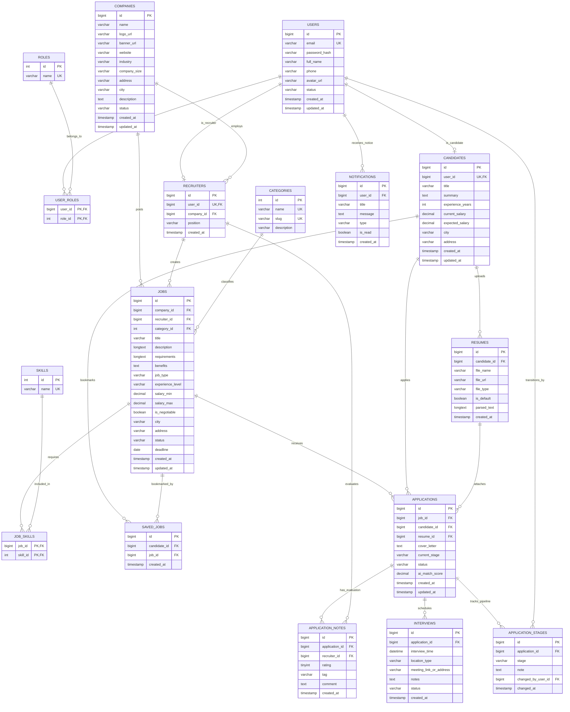

# 📊 BẢN VẼ THIẾT KẾ CƠ SỞ DỮ LIỆU (ERD) – DỰ ÁN TALENTBRIDGE

> **Dự án**: TalentBridge – Nền tảng tuyển dụng trực tuyến & Quản lý ứng viên (ATS)  
> **Chuẩn hóa**: 3NF (Third Normal Form) – 17 Bảng  
> **Hệ quản trị CSDL**: MySQL 8.0+ / MariaDB (`utf8mb4_unicode_ci`)  
> **Script DDL thực thi**: [`database/schema.sql`](../database/schema.sql)  
> **Mã nguồn DBML (vẽ online)**: [`docs/talentbridge_erd.dbml`](./talentbridge_erd.dbml)

---

## 1. 🖼️ SƠ ĐỒ THỰC THỂ QUAN HỆ CHI TIẾT (FULL MERMAID ERD)

---

## 2. 🌐 CÁCH XEM BẢN VẼ TƯƠNG TÁC ĐỒ HỌA TRÊN DBDATABASE (1-CLICK)

Nếu bạn muốn có một bản vẽ đồ họa có màu sắc, kéo thả các bảng trực quan, zoom in/out và xuất ảnh chất lượng cao:

1. Truy cập trang web miễn phí: 👉 **[https://dbdiagram.io/d](https://dbdiagram.io/d)**
2. Mở file [docs/talentbridge_erd.dbml](file:///D:/Mon%20hoc%20ITC/Java%20Spring%202/TalentBridge_JS2/docs/talentbridge_erd.dbml) đã được tạo sẵn trong dự án.
3. Copy toàn bộ nội dung và dán (paste) vào khung code bên trái của `dbdiagram.io`.
4. Màn hình bên phải sẽ lập tức tự động dựng nên sơ đồ CSDL hoàn chỉnh:
   - Các đường nối quan hệ Khóa ngoại (FK) rõ ràng.
   - Hiển thị từng trường, kiểu dữ liệu, ràng buộc PK/UK.
   - Bạn có thể bấm **Export** $\to$ **Export to PNG / PDF** để chèn vào Word đề tài hoặc Slide báo cáo bảo vệ đồ án!

---

## 3. 🧩 PHÂN TÍCH 5 CỤM CHỨC NĂNG CỐT LÕI (5 CORE CLUSTERS)

### Cụm 1: Phân quyền & Xác thực (Authentication & RBAC)
- `users`: Bảng trung tâm xác thực cho cả 3 Actor (`ROLE_CANDIDATE`, `ROLE_RECRUITER`, `ROLE_ADMIN`).
- `roles` & `user_roles`: Thiết kế N-N hỗ trợ người dùng sở hữu nhiều vai trò (ví dụ: một tài khoản có thể vừa là Ứng viên vừa thử vai trò Recruiter).

### Cụm 2: Hồ sơ Ứng viên & CV (Candidate & Resumes)
- `candidates`: Quan hệ 1-1 với `users` (mở rộng thuộc tính chuyên môn: năm kinh nghiệm, mức lương kỳ vọng).
- `resumes`: Quan hệ 1-N với `candidates`. Ứng viên có thể tải lên nhiều bản CV (PDF) khác nhau cho từng vị trí và tích chọn 1 bản làm mặc định (`is_default = true`). Trường `parsed_text` dùng để lưu text trích xuất phục vụ AI Matching.

### Cụm 3: Doanh nghiệp & Nhà tuyển dụng (Company & Recruiters)
- `companies`: Hồ sơ pháp nhân (tên, logo, website, quy mô, địa chỉ). Trạng thái duyệt `PENDING` $\to$ `APPROVED`/`REJECTED` do Admin quản lý.
- `recruiters`: Quan hệ 1-1 với `users` và N-1 với `companies`. Cho phép một công ty có nhiều HR/Recruiter cùng tham gia quản lý tuyển dụng.

### Cụm 4: Việc làm & Tìm kiếm (Jobs, Categories & Skills)
- `jobs`: Tin tuyển dụng thuộc về `companies`, do một `recruiters` tạo ra, thuộc một danh mục `categories`.
- `skills` & `job_skills`: Bảng trung gian N-N liên kết giữa công việc và danh sách kỹ năng (Java, Spring Boot, MySQL, Docker...).
- `saved_jobs`: Bảng liên kết ứng viên lưu tin yêu thích, có ràng buộc `UNIQUE(candidate_id, job_id)` tránh lưu trùng lặp.

### Cụm 5: Quy trình Tuyển dụng ATS & Phỏng vấn (ATS Pipeline)
- `applications`: Trung tâm của hệ thống ATS, liên kết giữa `job`, `candidate` và bản `resume` được chọn nộp. Ràng buộc `UNIQUE(job_id, candidate_id)` chống spam đơn nộp.
- `application_stages`: Lịch sử lưu lại vết kiểm toán (Audit Trail) khi chuyển vòng ứng viên: `APPLIED` $\to$ `SCREENING` $\to$ `INTERVIEW` $\to$ `OFFER` $\to$ `HIRED`/`REJECTED`.
- `application_notes`: HR chấm điểm (1-5 sao), gắn tag ("Tiềm năng", "Pass Technical") và viết note nội bộ.
- `interviews`: Xếp lịch phỏng vấn với ứng viên (Online qua Meet/Zoom hoặc Offline tại công ty).
- `notifications`: Hệ thống chuông thông báo trong app cho người dùng.

---

## 4. ⚡ CÁC ĐIỂM TỐI ƯU HIỆU NĂNG & CHUẨN DOANH NGHIỆP

1. **Chuẩn hóa 3NF tuyệt đối**: Không có phụ thuộc bắc cầu (transitive dependency), dữ liệu không bị dư thừa.
2. **Composite Indexes**:
   - `jobs(status, deadline)`: Tối ưu cho tác vụ quét định kỳ của Background Worker và lọc tin còn hạn.
   - `jobs(city, category_id)`: Tối ưu bộ lọc tìm kiếm việc làm đa tiêu chí.
   - `applications(job_id, current_stage)`: Tối ưu giao diện bảng Kanban ATS của nhà tuyển dụng.
3. **Cascade Rules**:
   - Khi xóa User hoặc Job, các bản ghi phụ thuộc (`candidates`, `resumes`, `job_skills`, `application_stages`) sẽ tự động xóa sạch qua `ON DELETE CASCADE`, tránh phát sinh rác/mồ côi trong CSDL.
