# 📊 BẢN VẼ THIẾT KẾ CƠ SỞ DỮ LIỆU (ERD) – DỰ ÁN TALENTBRIDGE

> **Dự án**: TalentBridge – Nền tảng tuyển dụng trực tuyến, Quản lý ứng viên (ATS) & Trình tạo CV (CV Builder)  
> **Chuẩn hóa**: 3NF (Third Normal Form) – **23 Bảng hoàn chỉnh**  
> **Hệ quản trị CSDL**: MySQL 8.0+ / MariaDB (`utf8mb4_unicode_ci`)  
> **Script DDL thực thi**: [`database/schema.sql`](../database/schema.sql)  
> **Mã nguồn DBML (vẽ online tương tác)**: [`docs/talentbridge_erd.dbml`](./talentbridge_erd.dbml)

---

## 1. 🖼️ SƠ ĐỒ THỰC THỂ QUAN HỆ CHI TIẾT (FULL MERMAID ERD - 23 TABLES)

```mermaid
erDiagram
    %% ====================================================
    %% 1. AUTHENTICATION & RBAC
    %% ====================================================
    USERS {
        bigint id PK
        varchar email UK
        varchar password_hash
        varchar full_name
        varchar phone
        varchar avatar_url
        varchar status
        timestamp created_at
        timestamp updated_at
    }

    ROLES {
        int id PK
        varchar name UK
    }

    USER_ROLES {
        bigint user_id PK,FK
        int role_id PK,FK
    }

    USERS ||--o{ USER_ROLES : "assigned_to"
    ROLES ||--o{ USER_ROLES : "belongs_to"

    %% ====================================================
    %% 2. CANDIDATE PROFILE (TOPCV STANDARD)
    %% ====================================================
    CANDIDATES {
        bigint id PK
        bigint user_id UK,FK
        varchar title
        date dob
        varchar gender
        text summary
        int experience_years
        decimal current_salary
        decimal expected_salary
        varchar city
        varchar address
        varchar personal_website
        varchar linkedin_url
        varchar github_url
        timestamp created_at
        timestamp updated_at
    }

    SKILLS {
        int id PK
        varchar name UK
    }

    WORK_EXPERIENCES {
        bigint id PK
        bigint candidate_id FK
        varchar company_name
        varchar position
        date start_date
        date end_date
        boolean is_current
        text description
        text achievements
        timestamp created_at
    }

    EDUCATIONS {
        bigint id PK
        bigint candidate_id FK
        varchar institution_name
        varchar degree
        varchar field_of_study
        date start_date
        date end_date
        boolean is_current
        varchar gpa
        text description
        timestamp created_at
    }

    CANDIDATE_SKILLS {
        bigint id PK
        bigint candidate_id FK
        int skill_id FK
        varchar proficiency_level
        tinyint rating
        decimal years_of_experience
    }

    CANDIDATE_PROJECTS {
        bigint id PK
        bigint candidate_id FK
        varchar project_name
        varchar role
        int team_size
        date start_date
        date end_date
        boolean is_current
        varchar technologies
        varchar project_url
        varchar github_url
        text description
        text responsibilities
        timestamp created_at
    }

    CANDIDATE_CERTIFICATES {
        bigint id PK
        bigint candidate_id FK
        varchar certificate_name
        varchar issuing_organization
        date issue_date
        date expiration_date
        varchar credential_id
        varchar credential_url
        timestamp created_at
    }

    CANDIDATE_AWARDS {
        bigint id PK
        bigint candidate_id FK
        varchar title
        varchar organization
        date issue_date
        text description
        timestamp created_at
    }

    USERS ||--o| CANDIDATES : "is_candidate"
    CANDIDATES ||--o{ WORK_EXPERIENCES : "has_experience"
    CANDIDATES ||--o{ EDUCATIONS : "has_education"
    CANDIDATES ||--o{ CANDIDATE_SKILLS : "possesses_skill"
    SKILLS ||--o{ CANDIDATE_SKILLS : "mapped_to_candidate"
    CANDIDATES ||--o{ CANDIDATE_PROJECTS : "built_project"
    CANDIDATES ||--o{ CANDIDATE_CERTIFICATES : "earned_cert"
    CANDIDATES ||--o{ CANDIDATE_AWARDS : "won_award"

    %% ====================================================
    %% 3. CV TEMPLATES & RESUMES (CV GENERATOR)
    %% ====================================================
    CV_TEMPLATES {
        int id PK
        varchar name
        varchar template_code UK
        varchar thumbnail_url
        varchar description
        json default_config
        boolean is_active
        timestamp created_at
    }

    RESUMES {
        bigint id PK
        bigint candidate_id FK
        int template_id FK
        varchar resume_type
        varchar title
        varchar file_name
        varchar file_url
        varchar file_type
        boolean is_default
        json customization_json
        longtext parsed_text
        timestamp created_at
    }

    CV_TEMPLATES ||--o{ RESUMES : "formats"
    CANDIDATES ||--o{ RESUMES : "owns_resume"

    %% ====================================================
    %% 4. COMPANY & RECRUITERS
    %% ====================================================
    COMPANIES {
        bigint id PK
        varchar name
        varchar logo_url
        varchar banner_url
        varchar website
        varchar industry
        varchar company_size
        varchar address
        varchar city
        text description
        varchar status
        timestamp created_at
        timestamp updated_at
    }

    RECRUITERS {
        bigint id PK
        bigint user_id UK,FK
        bigint company_id FK
        varchar position
        timestamp created_at
    }

    USERS ||--o| RECRUITERS : "is_recruiter"
    COMPANIES ||--o{ RECRUITERS : "employs"

    %% ====================================================
    %% 5. JOBS, CATEGORIES & SKILLS
    %% ====================================================
    CATEGORIES {
        int id PK
        varchar name UK
        varchar slug UK
        varchar description
    }

    JOBS {
        bigint id PK
        bigint company_id FK
        bigint recruiter_id FK
        int category_id FK
        varchar title
        longtext description
        longtext requirements
        text benefits
        varchar job_type
        varchar experience_level
        decimal salary_min
        decimal salary_max
        boolean is_negotiable
        varchar city
        varchar address
        varchar status
        date deadline
        timestamp created_at
        timestamp updated_at
    }

    JOB_SKILLS {
        bigint job_id PK,FK
        int skill_id PK,FK
    }

    SAVED_JOBS {
        bigint id PK
        bigint candidate_id FK
        bigint job_id FK
        timestamp created_at
    }

    COMPANIES ||--o{ JOBS : "posts"
    RECRUITERS ||--o{ JOBS : "creates"
    CATEGORIES ||--o{ JOBS : "classifies"
    JOBS ||--o{ JOB_SKILLS : "requires"
    SKILLS ||--o{ JOB_SKILLS : "included_in"
    CANDIDATES ||--o{ SAVED_JOBS : "bookmarks"
    JOBS ||--o{ SAVED_JOBS : "bookmarked_by"

    %% ====================================================
    %% 6. ATS PIPELINE & APPLICATION FLOW
    %% ====================================================
    APPLICATIONS {
        bigint id PK
        bigint job_id FK
        bigint candidate_id FK
        bigint resume_id FK
        text cover_letter
        varchar current_stage
        varchar status
        decimal ai_match_score
        timestamp created_at
        timestamp updated_at
    }

    APPLICATION_STAGES {
        bigint id PK
        bigint application_id FK
        varchar stage
        text note
        bigint changed_by_user_id FK
        timestamp changed_at
    }

    APPLICATION_NOTES {
        bigint id PK
        bigint application_id FK
        bigint recruiter_id FK
        tinyint rating
        varchar tag
        text comment
        timestamp created_at
    }

    INTERVIEWS {
        bigint id PK
        bigint application_id FK
        datetime interview_time
        varchar location_type
        varchar meeting_link_or_address
        text notes
        varchar status
        timestamp created_at
    }

    NOTIFICATIONS {
        bigint id PK
        bigint user_id FK
        varchar title
        text message
        varchar type
        boolean is_read
        timestamp created_at
    }

    JOBS ||--o{ APPLICATIONS : "receives"
    CANDIDATES ||--o{ APPLICATIONS : "applies"
    RESUMES ||--o{ APPLICATIONS : "attaches"
    APPLICATIONS ||--o{ APPLICATION_STAGES : "tracks_pipeline"
    USERS ||--o{ APPLICATION_STAGES : "transitions_by"
    APPLICATIONS ||--o{ APPLICATION_NOTES : "has_evaluation"
    RECRUITERS ||--o{ APPLICATION_NOTES : "evaluates"
    APPLICATIONS ||--o{ INTERVIEWS : "schedules"
    USERS ||--o{ NOTIFICATIONS : "receives_notice"
```

---

## 2. 🌐 CÁCH XEM BẢN VẼ TƯƠNG TÁC ĐỒ HỌA TRÊN DBDATABASE (1-CLICK)

Nếu bạn muốn có một bản vẽ đồ họa có màu sắc, kéo thả các bảng trực quan, zoom in/out và xuất ảnh chất lượng cao:

1. Truy cập trang web miễn phí: 👉 **[https://dbdiagram.io/d](https://dbdiagram.io/d)**
2. Mở file [docs/talentbridge_erd.dbml](file:///D:/Mon%20hoc%20ITC/Java%20Spring%202/TalentBridge_JS2/docs/talentbridge_erd.dbml) đã được tạo sẵn trong dự án.
3. Copy toàn bộ nội dung và dán (paste) vào khung code bên trái của `dbdiagram.io`.
4. Màn hình bên phải sẽ lập tức tự động dựng nên sơ đồ CSDL hoàn chỉnh 23 bảng:
   - Các đường nối quan hệ Khóa ngoại (FK) rõ ràng.
   - Hiển thị từng trường, kiểu dữ liệu, ràng buộc PK/UK.
   - Bạn có thể bấm **Export** $\to$ **Export to PNG / PDF** để chèn vào Word đề tài hoặc Slide báo cáo bảo vệ đồ án!

---

## 3. 🧩 PHÂN TÍCH 6 CỤM CHỨC NĂNG CỐT LÕI (6 CORE CLUSTERS)

### Cụm 1: Phân quyền & Xác thực (Authentication & RBAC)
- `users`: Bảng trung tâm xác thực cho cả 3 Actor (`ROLE_CANDIDATE`, `ROLE_RECRUITER`, `ROLE_ADMIN`).
- `roles` & `user_roles`: Thiết kế N-N hỗ trợ người dùng sở hữu nhiều vai trò linh hoạt.

### Cụm 2: Hồ sơ Ứng viên Chuẩn TopCV (TopCV Candidate Profile)
- `candidates`: Bổ sung thông tin cá nhân mở rộng (`dob`, `gender`, `bio`, `personal_website`, `linkedin_url`, `github_url`).
- `work_experiences`: Lịch sử làm việc qua từng công ty, chức danh, mô tả trách nhiệm và thành tựu (Key Achievements).
- `educations`: Lịch sử học vấn, bằng cấp, chuyên ngành, GPA, đồ án tốt nghiệp.
- `candidate_skills`: Kỹ năng chuyên môn, đánh giá mức độ 1-5 sao và số năm kinh nghiệm.
- `candidate_projects`: Dự án thực tế/cá nhân, công nghệ sử dụng, vai trò, link demo và GitHub.
- `candidate_certificates`: Chứng chỉ chuyên môn kèm đơn vị cấp và link xác thực.
- `candidate_awards`: Giải thưởng và thành tích cá nhân.

### Cụm 3: Mẫu CV & Bộ sinh CV Tự động (CV Templates & Resume Builder)
- `cv_templates`: Kho mẫu CV đa dạng (Modern IT, Classic Elegant, Creative Minimalist...) lưu cấu hình layout, font chữ, màu sắc chủ đạo.
- `resumes`: Hỗ trợ 2 hình thức:
  1. `UPLOADED`: Tải lên file PDF từ máy tính.
  2. `GENERATED`: Tự động kết xuất (generate) từ toàn bộ dữ liệu Profile của ứng viên theo `cv_templates` đã chọn, lưu kèm `customization_json`.

### Cụm 4: Doanh nghiệp & Nhà tuyển dụng (Company & Recruiters)
- `companies`: Hồ sơ pháp nhân, trạng thái duyệt `PENDING` $\to$ `APPROVED`/`REJECTED` do Admin quản lý.
- `recruiters`: Quan hệ 1-1 với `users` và N-1 với `companies`. Một công ty có thể có nhiều HR tuyển dụng.

### Cụm 5: Việc làm & Tìm kiếm (Jobs, Categories & Skills)
- `jobs`: Tin tuyển dụng thuộc về `companies`, do một `recruiters` tạo ra, thuộc một danh mục `categories`.
- `skills` & `job_skills`: Bảng trung gian N-N liên kết giữa công việc và danh sách kỹ năng cần tuyển.
- `saved_jobs`: Ứng viên lưu tin yêu thích (`UNIQUE(candidate_id, job_id)`).

### Cụm 6: Quy trình Tuyển dụng ATS & Phỏng vấn (ATS Pipeline)
- `applications`: Trung tâm của hệ thống ATS, liên kết `job`, `candidate` và bản `resume`. Ràng buộc `UNIQUE(job_id, candidate_id)` chống spam đơn nộp.
- `application_stages`: Lịch sử lưu lại vết kiểm toán (Audit Trail) khi chuyển vòng ứng viên.
- `application_notes`: HR chấm điểm (1-5 sao), gắn tag và viết note đánh giá nội bộ.
- `interviews`: Xếp lịch phỏng vấn với ứng viên (Online hoặc Offline).
- `notifications`: Thông báo trong ứng dụng cho người dùng.

---

## 4. ⚡ CÁC ĐIỂM TỐI ƯU HIỆU NĂNG & CHUẨN DOANH NGHIỆP

1. **Chuẩn hóa 3NF tuyệt đối**: Các phần tử lặp (kinh nghiệm, kỹ năng, học vấn, dự án) đều được tách thành các bảng quan hệ độc lập.
2. **Composite Indexes**:
   - `jobs(status, deadline)`: Tối ưu quét tin còn hạn.
   - `jobs(city, category_id)`: Tối ưu bộ lọc tìm việc.
   - `applications(job_id, current_stage)`: Tối ưu giao diện Kanban ATS.
   - `candidate_skills(candidate_id, skill_id)`: Tìm kiếm ứng viên theo kỹ năng siêu tốc.
3. **Cascade Integrity Rules**:
   - Mọi thực thể con của ứng viên (`work_experiences`, `educations`, `candidate_skills`, `candidate_projects`, `candidate_certificates`, `candidate_awards`, `resumes`) đều cấu hình `ON DELETE CASCADE` theo `candidates`. Khi xóa tài khoản ứng viên, toàn bộ profile phụ thuộc sẽ được dọn dẹp sạch sẽ.