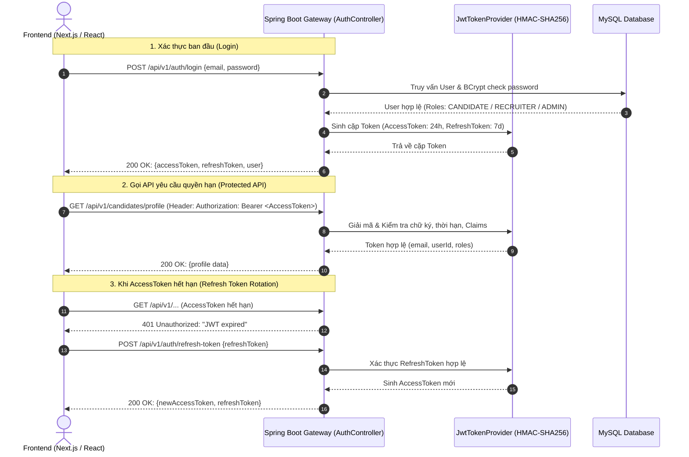

# 🔐 ĐẶC TẢ THIẾT KẾ TOKEN & QUY CHUẨN XÁC THỰC (TOKEN DESIGN SPEC) - HRPM-24

> **Dự án**: TalentBridge ATS Platform  
> **Tác giả**: Lê Duy Khánh (Tech Lead)  
> **Tiêu chuẩn áp dụng**: RFC 7519 (JSON Web Token), RFC 6749 (OAuth 2.0 Bearer Token), RFC 7807 (Problem Details)  
> **Tài liệu OpenAPI Spec đính kèm**: `docs/api-specs/auth-api-spec.yaml`

---

## 1. 🏗️ KIẾN TRÚC TỔNG QUAN (TOKEN ARCHITECTURE)

Hệ thống TalentBridge sử dụng kiến trúc xác thực **Stateless JWT (JSON Web Token)** kết hợp cơ chế **Token Pair (Access Token + Refresh Token)** nhằm tối ưu hiệu năng, giảm tải cho Database và nâng cao độ an toàn.



---

## 2. 🔑 CẤU TRÚC CHI TIẾT CỦA CÁC LOẠI TOKEN

### 2.1. Access Token (Dùng cho mọi Request cần bảo mật)

* **Thuật toán ký**: `HMAC-SHA256` (`HS256`).
* **Thời gian sống (TTL)**: `86,400,000 ms` (24 giờ) trong môi trường phát triển (hoặc `15-30 phút` trong Production).
* **Vị trí truyền tải**: HTTP Request Header:
  ```http
  Authorization: Bearer <accessToken>
  ```

#### Cấu trúc Payload (Claims) của Access Token:
```json
{
  "sub": "candidate@talentbridge.vn",
  "userId": 1,
  "roles": [
    "ROLE_CANDIDATE"
  ],
  "iat": 1726300800,
  "exp": 1726387200
}
```

* **Giải thích các trường (Claims)**:
  * `sub` (*Subject*): Địa chỉ email đăng nhập của người dùng.
  * `userId`: ID định danh duy nhất của người dùng trong bảng `users` (giúp các UseCase lấy nhanh User ID mà không cần query lại DB).
  * `roles`: Danh sách vai trò quyền hạn (`ROLE_CANDIDATE`, `ROLE_RECRUITER`, `ROLE_ADMIN`) phục vụ Spring Security `@PreAuthorize`.
  * `iat` (*Issued At*): Thời điểm phát hành token (Unix timestamp tính bằng giây).
  * `exp` (*Expiration*): Thời điểm token hết hạn.

---

### 2.2. Refresh Token (Dùng để cấp lại Access Token)

* **Thuật toán ký**: `HMAC-SHA256` (`HS256`).
* **Thời gian sống (TTL)**: `604,800,000 ms` (7 ngày).
* **Đặc điểm bảo mật**:
  * Chỉ chứa thông tin nhận diện cơ bản (`sub`: email), không chứa roles hay thông tin nhạy cảm.
  * Chỉ được gửi lên endpoint duy nhất: `POST /api/v1/auth/refresh-token`.
  * Client lưu trữ an toàn trong `HttpOnly Secure Cookie` hoặc `LocalStorage`.

---

## 3. 🛡️ QUY CHUẨN XỬ LÝ LỖI XÁC THỰC (ERROR CONTRACT)

Hệ thống tuân thủ nghiêm ngặt định dạng phản hồi chuẩn hóa:

| Mã HTTP Status | Tình huống phát sinh | Cấu trúc phản hồi mẫu |
| :---: | :--- | :--- |
| **`400 Bad Request`** | Dữ liệu gửi lên thiếu trường bắt buộc hoặc sai định dạng | `{"statusCode": 400, "message": "Email không đúng định dạng", "timestamp": "..."}` |
| **`401 Unauthorized`** | Sai mật khẩu, Token hết hạn, chữ ký không hợp lệ | `{"statusCode": 401, "message": "Email hoặc mật khẩu không chính xác", "timestamp": "..."}` |
| **`403 Forbidden`** | Đã đăng nhập nhưng không đủ quyền hạn (hoặc tài khoản bị BANNED) | `{"statusCode": 403, "message": "Tài khoản của bạn đã bị khóa bởi Quản trị viên", "timestamp": "..."}` |
| **`429 Too Many Requests`** | Đăng nhập sai quá ngưỡng cho phép | `{"statusCode": 42901, "message": "Bạn đã đăng nhập sai quá nhiều lần. Vui lòng thử lại sau", "timestamp": "..."}` |
| **`409 Conflict`** | Đăng ký với email đã tồn tại trong CSDL | `{"statusCode": 409, "message": "Email candidate@talentbridge.vn đã tồn tại", "timestamp": "..."}` |

---

## 4. 💻 HƯỚNG DẪN TÍCH HỢP CHO PHÍA FRONTEND (NEXT.JS / REACT)

Đoạn mã cấu hình Axios Interceptor mẫu dành cho team Frontend (`next-demo` hoặc React):

```typescript
import axios from 'axios';

const apiClient = axios.create({
  baseURL: process.env.NEXT_PUBLIC_API_URL || 'http://localhost:8080/api/v1',
  headers: {
    'Content-Type': 'application/json',
  },
});

// Request Interceptor: Tự động gắn Bearer Token
apiClient.interceptors.request.use((config) => {
  const token = localStorage.getItem('accessToken');
  if (token) {
    config.headers.Authorization = `Bearer ${token}`;
  }
  return config;
});

// Response Interceptor: Tự động Refresh Token khi gặp 401
apiClient.interceptors.response.use(
  (response) => response,
  async (error) => {
    const originalRequest = error.config;
    if (error.response?.status === 401 && !originalRequest._retry) {
      originalRequest._retry = true;
      const refreshToken = localStorage.getItem('refreshToken');
      if (refreshToken) {
        try {
          const res = await axios.post('http://localhost:8080/api/v1/auth/refresh-token', {
            refreshToken,
          });
          const newAccessToken = res.data.data.accessToken;
          localStorage.setItem('accessToken', newAccessToken);
          originalRequest.headers.Authorization = `Bearer ${newAccessToken}`;
          return apiClient(originalRequest);
        } catch (refreshErr) {
          localStorage.removeItem('accessToken');
          localStorage.removeItem('refreshToken');
          window.location.href = '/auth/login';
        }
      }
    }
    return Promise.reject(error);
  }
);

export default apiClient;
```
